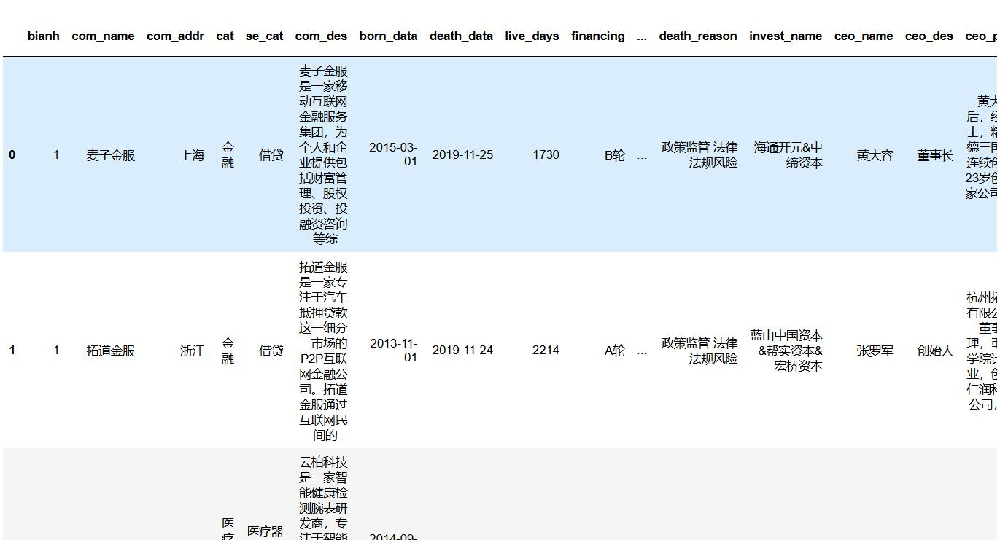
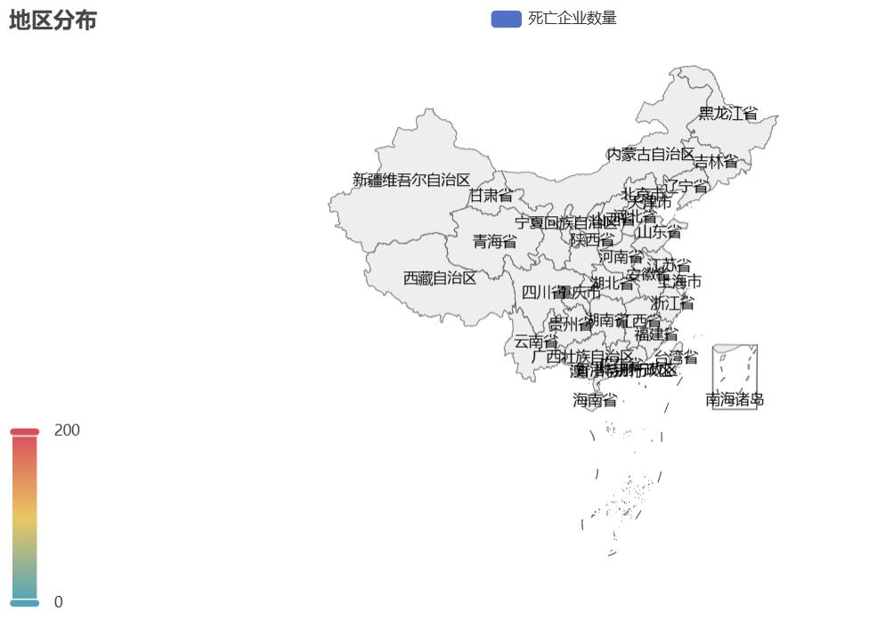
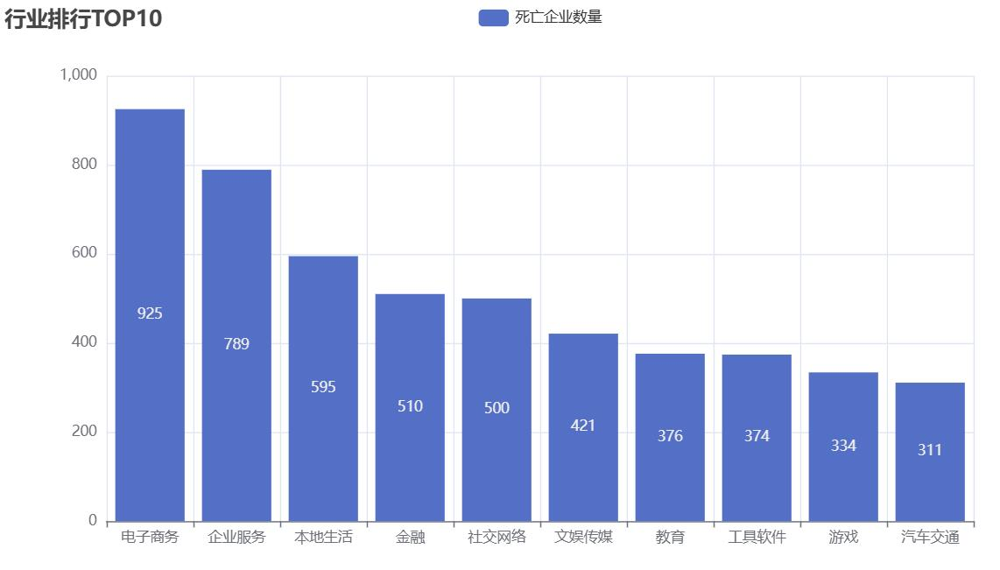
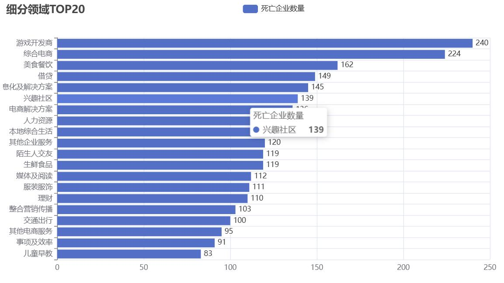
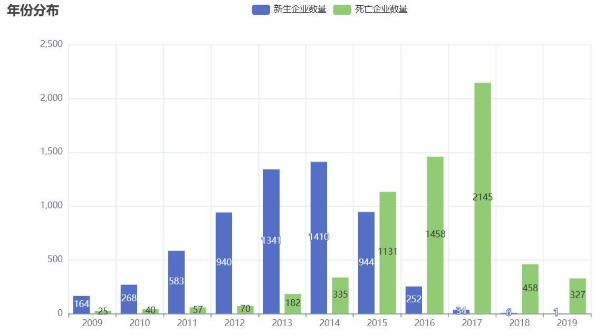
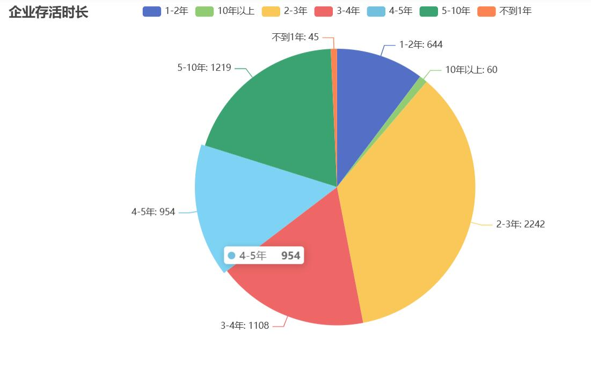

# 倒闭企业数据分析

> 基于 pandas + pyecharts 对倒闭企业数据集 `com.csv` 进行清洗、统计与可视化，从地区、行业、时间、存活周期、投资人、倒闭原因、CEO描述多维度分析倒闭企业特征。

## 一、项目简介

### 1.1 项目目标
读取倒闭企业csv数据集，完成基础数据处理，实现如下可视化：
1. 倒闭企业全国地理分布地图
2. 倒闭企业所属行业TOP10柱状图
3. 细分领域TOP20横向排行柱状图
4. 企业新生&倒闭年份对比柱状图
5. 企业存活时长占比饼图
6. 投资人词云
7. 倒闭原因词云
8. CEO人物描述词云

### 1.2 技术栈
|工具|用途|
|---|---|
|pandas|csv读取、分组统计、数据处理|
|pyecharts|Map、Bar、Pie、WordCloud图表可视化|
|jieba|中文文本分词，用于CEO描述文本词云|
|Jupyter Notebook|交互式渲染图表 `render_notebook()`|

### 1.3 数据集说明
输入文件：`com.csv`
关键字段说明：
- `com_addr`：企业所在地区
- `cat`：企业大行业分类
- `se_cat`：企业细分领域
- `born_data`：企业成立日期
- `death_data`：企业倒闭日期
- `live_days`：企业存活天数
- `invest_name`：投资机构，多个使用`&`分隔
- `death_reason`：企业倒闭原因，空格分隔关键词
- `ceo_per_des`：CEO人物描述文本

## 二、数据预处理说明
1. 对企业地址去除首尾空格；
2. 从成立、倒闭日期字符串截取前4位得到年份；
3. 根据存活天数`live_days`划分存活时长区间；
4. 对多值字段（投资人、倒闭原因）按分隔符拆分，统计词频；
5. 使用jieba对CEO描述文本做中文分词，过滤单字，统计词频。

## 三、各模块可视化代码

### 3.1 导入数据

```python
import pandas as pd 
data = pd.read_csv('com.csv')
data.head()
```



### 3.2 倒闭企业地区分布地图

对企业地址分组统计倒闭企业数量，绘制中国地图。



### 3.3 行业排行 TOP10 柱状图

统计各大行业倒闭企业数量，取前 10。



### 3.4 细分领域 TOP20 横向柱状图

细分领域倒闭企业 TOP20，反转坐标轴横向展示。



### 3.5 企业新生与倒闭年份分布

截取成立、倒闭的年份，合并两张统计表，筛选 2008 年之后数据，对比每年新生、倒闭企业数量。



### 3.6 企业存活时长饼图

自定义函数，将存活天数划分成不同生命周期区间，统计各个区间企业数量，绘制饼图。



### 3.7 投资人词云

拆分`invest_name`字段（`&`分隔），统计投资机构出现频次，生成词云。


### 3.8 倒闭原因词云

按空格拆分倒闭原因字段，统计关键词频次，生成词云。


### 3.9 CEO 描述词云

使用 jieba 分词处理 CEO 人物描述文本，过滤单字，统计词频生成词云。

